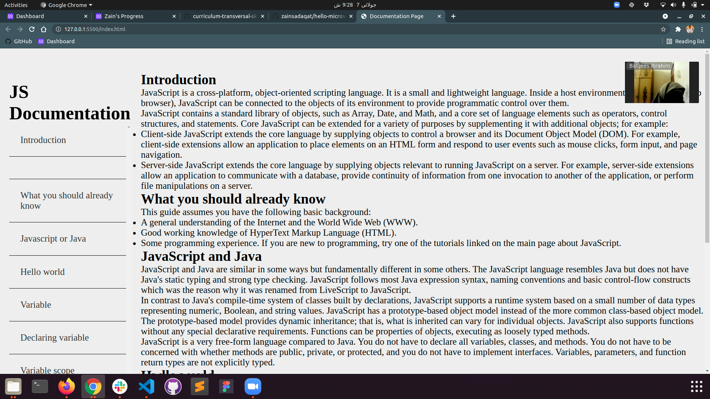

# Admission Trial Code Review

> This is the project that I did with my coding partner by following pair programming rules.

Additional description about the project and its features.

## Built With

- HTML5
- CSS3

## Getting Started

**This is an example of how you may give instructions on setting up your project locally.**
**Modify this file to match your project, remove sections that don't apply. For example: delete the testing section if the currect project doesn't require testing.**

To get a local copy up and running follow these simple example steps.

### Prerequisites

### Setup

### Install

### Usage

### Deployment

## Authors

👤 **Zain Sadaqat**

- GitHub: [@githubhandle](https://github.com/zainsadaqat)
- Twitter: [@twitterhandle](https://twitter.com/zain_sadaqat)
- LinkedIn: [LinkedIn](https://linkedin.com/in/zainsadaqat)

👤 **Balqees Hashmi**

- GitHub: [@githubhandle](https://github.com/balqees)
- Twitter: [@twitterhandle](https://twitter.com/balqees)
- LinkedIn: [LinkedIn](https://linkedin.com/in/balqees)

## 🤝 Contributing

Contributions, issues, and feature requests are welcome!

Feel free to check the [issues page](../../issues/).

## Show your support

Give a ⭐️ if you like this project!

## Acknowledgments

- These code files ( HTML & CSS ) belong to my coding partner Balqees Hashmi. She provided these files
and own all rights. Thanks Balqees!

## 📝 License

This project is [MIT](./MIT.md) licensed.
